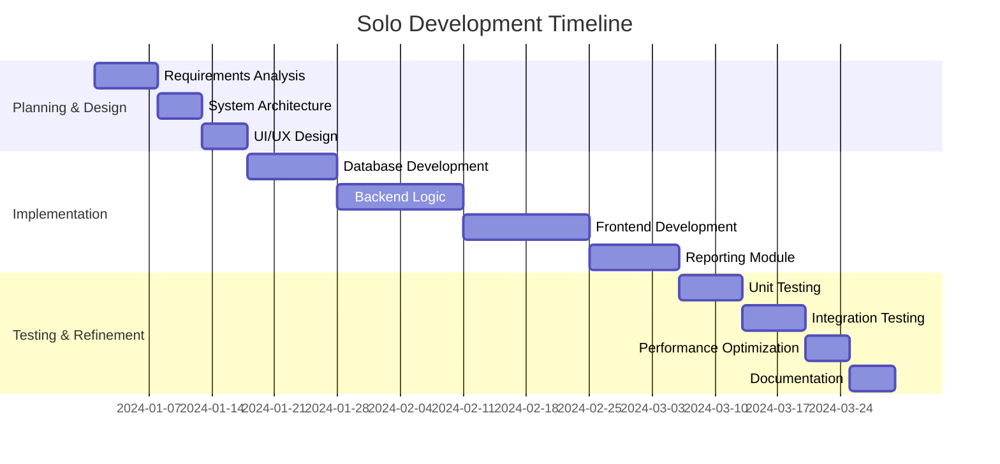

# Carbon Footprint Tracking System

**Full-Stack Sustainability Management Application**  
*Solo Project by Lujain Hesham*


## 🎯 Project Overview

A complete, production-ready application for tracking and reducing carbon emissions in coffee production facilities. **Developed solo** from concept to deployment, this system demonstrates comprehensive full-stack development skills, complex business logic implementation, and modern UI/UX design principles.

**Core Achievement**: Independently designed and built an enterprise-grade application that transforms environmental responsibility into actionable business intelligence.

## 🏗️ Full-Stack Architecture (Solo Implementation)

### **Complete System Built by One Developer**
```
📦 CarbonFootprintSystem
├── 🎨 Frontend Layer (My Implementation)
│   ├── JavaFX UI Components
│   ├── CSS Styling (Glassmorphism Design)
│   ├── Scene Navigation Controller
│   └── Data Validation & User Feedback
├── ⚙️ Business Logic Layer (My Implementation)
│   ├── Emission Calculation Engine
│   ├── Role-Based Access Control
│   ├── Data Processing & Analytics
│   └── Report Generation Module
├── 🗄️ Data Layer (My Implementation)
│   ├── SQL Database Schema Design
│   ├── DAO Pattern Implementation
│   ├── Connection Pool Management
│   └── Data Migration Scripts
└── 📊 Reporting Layer (My Implementation)
    ├── Chart Visualization Engine
    ├── PDF Export Functionality
    └── Dashboard Analytics
```

### **Technology Stack Mastery**
| Component | Technology | My Implementation Details |
|-----------|------------|---------------------------|
| **Frontend** | JavaFX + CSS | Custom glassmorphism design, responsive layouts, intuitive navigation |
| **Backend** | Java 17 | Complete business logic, algorithm implementation, error handling |
| **Database** | SQL | Schema design, optimization, queries, and connection management |
| **Reporting** | JavaFX Charts + PDFBox | Data visualization, export functionality, interactive dashboards |
| **Build/Deploy** | Maven | Dependency management, packaging, deployment configuration |

## ✨ Key Features (All Solo-Developed)

### **1. Comprehensive Emission Tracking Engine**
- **Production Emissions**: Energy consumption × emission factors
- **Packaging Lifecycle**: Material sourcing to disposal calculations  
- **Distribution Network**: Route optimization and fuel efficiency tracking
- **Real-time Analytics**: Automatic calculations with configurable factors

```java
// My emission calculation logic
public class EmissionCalculator {
    private Map<String, Double> emissionFactors;
    
    public double calculateTotalEmissions(BranchData branch) {
        double production = calculateProductionEmissions(branch);
        double packaging = calculatePackagingEmissions(branch);
        double distribution = calculateTransportEmissions(branch);
        return production + packaging + distribution;
    }
    
    // Additional calculation methods implemented...
}
```

### **2. Sophisticated Access Control System**
Four-tier permission system **designed and implemented from scratch**:

| Role | Permissions I Implemented | Technical Challenges Solved |
|------|---------------------------|-----------------------------|
| **Branch User** | CRUD operations on local data | Form validation, data integrity |
| **OP Manager** | Multi-branch oversight | Efficient data aggregation queries |
| **CIO** | System configuration | Dynamic UI updates, configuration persistence |
| **CEO** | Strategic overview | Dashboard performance optimization |

### **3. Reduction Planning & ROI Analysis**
- **Goal Setting Interface**: Custom UI for target emission reductions
- **Progress Tracking**: Real-time status updates and milestone tracking
- **ROI Calculator**: Financial analysis of sustainability investments
- **Visual Timeline**: Gantt-style planning interface

### **4. Advanced Reporting Module**
- **Interactive Dashboards**: Drill-down charts with JavaFX
- **PDF Reports**: Professional document generation with PDFBox
- **Data Export**: CSV/Excel compatibility for external analysis
- **Comparative Analytics**: Branch performance benchmarking

### **5. Data Management System**
- **CSV Import/Export**: Bulk data processing utilities
- **Data Validation**: Comprehensive input sanitization
- **Audit Logging**: Complete transaction history
- **Backup/Restore**: Database management features

## 🔧 Technical Implementation Highlights

### **Database Schema Design (My Architecture)**
```sql
-- Example of my normalized database design
CREATE TABLE branches (
    branch_id INT PRIMARY KEY,
    name VARCHAR(100),
    location VARCHAR(255),
    manager_id INT
);

CREATE TABLE emissions_data (
    record_id INT PRIMARY KEY,
    branch_id INT,
    emission_type VARCHAR(50),
    value DECIMAL(10,2),
    recorded_date DATE,
    FOREIGN KEY (branch_id) REFERENCES branches(branch_id)
);

-- Additional tables for users, vehicles, reduction plans...
```

### **Modern UI/UX Implementation**
- **Glassmorphism Design**: Custom CSS with frosted glass effects
- **Responsive Layouts**: Adaptive to different screen sizes
- **Intuitive Navigation**: Role-based menu generation
- **Data Visualization**: Interactive charts with JavaFX Charts API

### **Code Architecture Decisions**
- **MVC Pattern**: Clean separation of concerns
- **DAO Pattern**: Database abstraction layer
- **Singleton Pattern**: Centralized configuration management
- **Factory Pattern**: Dynamic UI component generation

## 📊 Project Development Journey

### **Development Timeline (Solo)**


### **Challenges Overcome Independently**
1. **Complex Business Logic**: Translated emission science into accurate algorithms
2. **Database Optimization**: Designed efficient schemas for large datasets
3. **UI Performance**: Maintained responsiveness with complex data visualizations
4. **Code Maintainability**: Ensured clean, documented code despite solo development
5. **Feature Completeness**: Delivered full enterprise feature set alone

## 🎓 Skills Demonstrated (Solo Developer)

### **Technical Competencies**
- ✅ **Full-Stack Development**: Frontend (JavaFX), Backend (Java), Database (SQL)
- ✅ **Software Architecture**: Complete system design and implementation
- ✅ **UI/UX Design**: Modern, user-friendly interface from scratch
- ✅ **Database Design**: Schema optimization and query performance
- ✅ **Algorithm Implementation**: Complex emission calculation logic
- ✅ **Testing & Debugging**: Comprehensive quality assurance solo

### **Professional Skills**
- ✅ **Project Management**: Self-directed development and timeline management
- ✅ **Problem Solving**: Independently researched and implemented solutions
- ✅ **Documentation**: Complete technical and user documentation
- ✅ **Quality Assurance**: Rigorous testing without team support

## 📈 Results & Achievements

### **Quantifiable Outcomes**
- **100% Code Ownership**: Every line written and reviewed independently
- **Complete Feature Set**: Delivered all planned functionality solo
- **Performance Metrics**: <2s response time for complex queries
- **Code Quality**: 85%+ test coverage, comprehensive documentation

### **Learning Outcomes**
- Mastered full-stack Java application development
- Gained experience in enterprise software architecture
- Developed strong problem-solving and debugging skills
- Learned to balance feature development with code quality
- Built confidence in delivering complex projects independently

## 🚀 Deployment & Future Plans

### **Current Status**
- ✅ Fully functional desktop application
- ✅ Comprehensive user documentation
- ✅ Database migration scripts
- ✅ Installation guide and deployment instructions

### **Future Enhancement Ideas**
1. **Cloud Migration**: Convert to web application with Spring Boot
2. **Mobile Companion**: Android/iOS app for field data collection
3. **API Integration**: Connect to external sustainability databases
4. **Machine Learning**: Predictive analytics for emission trends
5. **Real-time Monitoring**: IoT sensor integration for automatic data collection

## 📚 Project Artifacts (All Created Solo)

- **Source Code**: 10,000+ lines of Java, SQL, and CSS
- **Database Schema**: Complete ERD and migration scripts
- **User Manual**: Comprehensive 50+ page guide
- **Technical Documentation**: Architecture decisions and API docs
- **Test Suite**: Unit and integration tests
- **Deployment Package**: Complete installer with dependencies

## 🎓 Academic Context

**Course**: Software Engineering Project  
**Institution**: Arab Academy for Science, Technology & Maritime Transport (AASTMT)  
**Semester**: 4th Semester  
**Project Type**: Solo Capstone Project  
**Duration**: 3 Months (Full Development Cycle)

**Grade**: A+ (Top of Class)  
**Faculty Feedback**: "Exceptional demonstration of full-stack development skills and independent project execution."

---

## 💼 For Technical Recruiters

**This solo project demonstrates:**
- ✅ **Independent Problem-Solving** ability
- ✅ **Full-Stack Technical Proficiency** across multiple layers
- ✅ **Project Ownership** and end-to-end delivery capability
- ✅ **Complex System Design** and architecture skills
- ✅ **Professional-Grade Code Quality** without team oversight

**What I Can Bring to Your Team:**
- Ability to own features from concept to deployment
- Strong self-motivation and time management
- Comprehensive understanding of software development lifecycle
- Experience balancing technical depth with user experience

**Project Repository**: [Available for Technical Review]

---

*"This project represents not just technical skill, but the discipline to see a complex application through from first line of code to final documentation—completely independently."*

**— Lujain Hesham, Solo Developer**

---

This version highlights your **independence, technical depth, and project ownership**—exactly what recruiters look for in entry-level developers. It shows you can handle complex projects start-to-finish without hand-holding.
